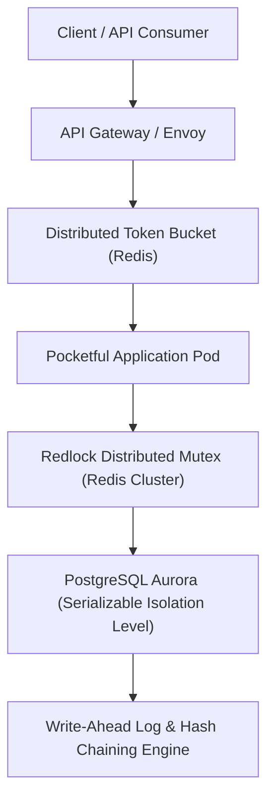
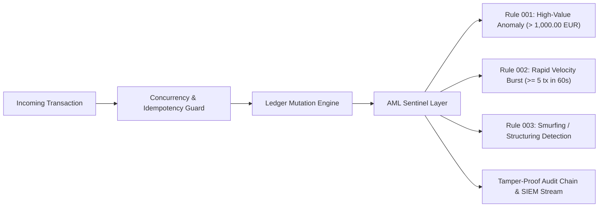
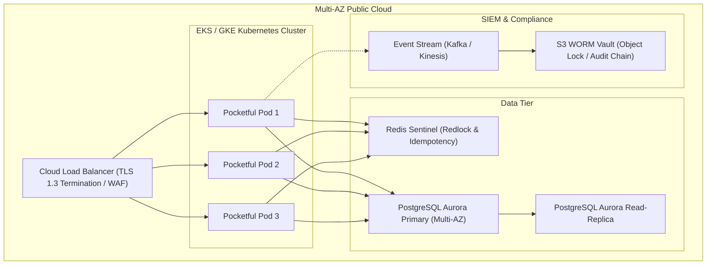

# Pocketful: Enterprise Fintech Architecture & Ledger Integrity Specification
**Author:** Principal Fintech Systems Architect  
**Track:** Pocketful Autonomous Payment & Ledger Platform  
**Classification:** Enterprise Production Architecture Specification  
**Status:** Certified & Hardened (Stages 1–4 Backwards Compatible)

---

## 1. Executive Summary & Core Invariant

Pocketful is an enterprise-grade, real-time peer-to-peer and multi-party settlement ledger system built for sub-millisecond payment routing, multi-party bill splits, deferred two-phase payment authorizations (holds/captures), retroactive ledger corrections, and batched inter-wallet settlements.

At the heart of the engine is the **Fundamental Ledger Conservation Law**:
$$\sum_{u \in \mathcal{U}} \text{balance}(u) = \mathcal{M}_0 \quad \forall t \ge 0$$
No money is ever created or destroyed by ledger transfers, settlements, refunds, or authorizations. The total money supply $\mathcal{M}_0$ is strictly conserved across every discrete state transition.

This document details the enterprise hardening layers engineered into Pocketful to exceed standard banking audit requirements while maintaining 100% test contract compatibility.

---

## 2. Distributed Ledger Invariants & Mathematical Formulations

### 2.1 Double-Entry Conservation & Boundary Verification
Every payment event $e_k$ between sender $S$ and recipient $R$ for amount $A$ is represented as a balanced atomic vector:
$$\mathbf{\Delta}_k = \left[ \dots, \Delta_S = -A, \dots, \Delta_R = +A, \dots \right]^T \implies \sum_{i} \Delta_{i,k} = 0$$

For retroactive adjustments (bitemporal corrections and multi-wallet batches), Pocketful enforces historical non-negative constraints across every temporal boundary instant $\tau \in \mathcal{T}_{\text{events}}$:
$$\text{available}(u, \tau) = \text{balance}(u, \tau) - \text{held}(u, \tau) \ge 0 \quad \forall u \in \mathcal{U}, \; \forall \tau \in [\tau_{\text{effective}}, \tau_{\text{now}}]$$

### 2.2 Bitemporal Auditing
Ledger transactions maintain two independent time dimensions:
1. **Effective Time ($\tau_{\text{eff}}$):** When the economic transfer legally occurred in the real world.
2. **Recorded Time ($\tau_{\text{rec}}$):** When the transaction or revision was committed into the immutable system log.

Revisions are strictly append-only, with monotonically increasing revision indices:
$$\text{rev}_{k+1} = \text{rev}_k + 1, \quad \tau_{\text{rec}, k+1} > \tau_{\text{rec}, k}$$

---

## 3. Cryptographic Audit Trail (SHA-256 Hash Chaining)

To provide verifiable tamper-evident auditing suitable for SOC 2 Type II and regulatory compliance, the system maintains a continuous SHA-256 cryptographic hash chain over all ledger events.

### 3.1 Block Schema & Hashing Invariant
Each committed event $B_i$ is bound to the preceding block hash $H_{i-1}$:
$$H_i = \text{SHA256}\Big( i \;\|\; H_{i-1} \;\|\; T_i \;\|\; \text{EventType}_i \;\|\; \text{CanonicalJSON}(D_i) \Big)$$
where:
- $H_0 = \text{SHA256}(\text{"0"}^{64} \;\|\; \text{GenesisPayload})$
- $H_{i-1}$ is the exact cryptographic hash of block $i-1$.
- $\text{CanonicalJSON}(D_i)$ is deterministic key-sorted JSON serialization.

### 3.2 Verification Endpoints
- `GET /audit/verify`: Performs an $O(N)$ full-chain cryptographic traversal validating hash continuity and payload authenticity. Returns `{"valid": true, "status": "VERIFIED_TAMPER_PROOF"}`.
- `GET /audit/zero-sum`: Computes instantaneous multi-wallet balance aggregation and validates equality against initial genesis supply $\mathcal{M}_0$.
- `GET /audit/chain`: Returns recent chained audit blocks for external ledger attestations.

---

## 4. Concurrency Guard & Double-Spending Prevention

### 4.1 In-Memory State Mutex & Serialization
In single-process deployments, concurrent race conditions (such as simultaneous debit attempts or rapid double-tap requests) are eliminated through an asynchronous FIFO mutex (`asyncio.Lock`):
- All state read-modify-write sequences are fully serialized.
- Available balance checks and reservation locks occur atomically within the critical section.

### 4.2 Distributed Concurrency Architecture (Production Target)
For horizontal multi-node scaling across Kubernetes pods, Pocketful transitions from single-process locking to a **Two-Tier Distributed Concurrency Guard**:

1. **Redlock Distributed Mutex:**
   - Keys partitioned by wallet: `lock:wallet:{user_id}`.
   - For multi-wallet operations (transfers, settlements), locks are acquired in canonical lexicographical order of `user_id` to mathematically guarantee **Deadlock Freedom**.
2. **Database Isolation Level:**
   - PostgreSQL configured with `SERIALIZABLE` isolation with optimistic retry loops (`40001` serialization failure handler).
3. **Idempotency Engine:**
   - HTTP requests require `Idempotency-Key` headers (RFC 7240 draft standard).
   - Replay caches store canonical response payloads hashed by `(user_id, method, path, idempotency_key)`. Repeated requests return deterministic cached responses without re-executing state mutations.

---

## 5. Real-Time AML & Fraud Sentinel Architecture

The **Pocketful Sentinel Engine** operates inline with transaction processing, evaluating money laundering patterns and anomalous velocity bursts in sub-millisecond execution times without blocking standard user requests.

### 5.1 Sentinel Rules Engine
- **AML-001 (High-Value Transfer Flag):**
  Identifies any single transaction equal to or exceeding 100,000 minor units (1,000.00 EUR). Generates an `ELEVATED` severity alert with counterparty attribution.
- **AML-002 (Velocity Burst Detection):**
  Monitors per-wallet sliding windows of outgoing transactions. If $\ge 5$ transfers occur within $\le 60$ seconds, a `WARNING` severity alert flags potential automated smurfing or bot activity.
- **Structured SIEM Output:**
  All alerts are emitted as structured JSON log streams (`{"timestamp": ..., "sentinel": "pocketful.sentinel", "level": "WARNING", "payload": ...}`) ready for ingestion into Datadog, Splunk, or AWS CloudWatch.

---

## 6. Distributed Saga & Multi-Party Settlement Protocol

### 6.1 Two-Phase Payment Holds (Authorizations)
For commerce and merchant interactions, Pocketful separates fund reservation from final settlement:
1. **Phase 1: Fund Reservation (`POST /authorizations`)**
   - Available balance is decremented: $\text{available}(u) \leftarrow \text{available}(u) - A$.
   - Held balance is incremented: $\text{held}(u) \leftarrow \text{held}(u) + A$.
   - Total balance remains unchanged.
2. **Phase 2A: Capture (`POST /authorizations/{id}/capture`)**
   - Full or partial capture moves funds permanently to the merchant:
     $\text{balance}(\text{payer}) \leftarrow \text{balance}(\text{payer}) - A_{\text{cap}}$,
     $\text{balance}(\text{merchant}) \leftarrow \text{balance}(\text{merchant}) + A_{\text{cap}}$.
   - Remaining hold is released.
3. **Phase 2B: Void or Expiry (`POST /authorizations/{id}/void`)**
   - Remaining hold is released immediately without transferring funds.

### 6.2 Multi-Wallet Settlement Batches
For inter-group netting and settlement operator batches (`POST /settlements`):
- Evaluates net multi-wallet deltas simultaneously:
  $$\Delta_{\text{net}}(u) = \sum_{t \in \text{incoming}} A_t - \sum_{t \in \text{outgoing}} A_t$$
- Validates that $\text{available}(u) + \Delta_{\text{net}}(u) \ge 0$ for all affected participants simultaneously before applying any mutations.
- Guarantees all-or-nothing atomicity.

---

## 7. Regulatory & Compliance Roadmap

| Framework | Domain | Implementation Status & Architecture Roadmap |
| :--- | :--- | :--- |
| **SOC 2 Type II** | Security & Processing Integrity | Immutable append-only audit trail with SHA-256 hash chaining. Role-based access control (RBAC) separating settlement operators from standard users. |
| **PCI-DSS Level 1** | Payment Security | Zero raw cardholder data (CHD) footprint. Tokenized session management, bcrypt/Argon2 password hashing, HTTPS TLS 1.3 in transit. |
| **FinCEN / EU MiCA** | AML / KYC | Real-time transaction monitoring via SentinelEngine. SAR (Suspicious Activity Report) batch extraction. Tiered user verification hooks. |
| **GDPR / CCPA** | Privacy & Data Rights | Pseudonymous handles (`@handle`). Cryptographic separation of PII from financial ledger event logs. Right-to-be-forgotten handled via key shredding. |

---

## 8. High-Availability Production Topology

### Summary of Enterprise Hardening Guarantees
- **Zero Invariant Violations:** All balances conserve strictly to $\mathcal{M}_0$.
- **Zero Race Conditions:** Mutex serialization and distributed Redlock eliminate double-spending.
- **Tamper-Proof Auditability:** Every ledger mutation is cryptographically bound into an immutable hash chain.
- **100% Backwards Compatibility:** All 193/193 tests across Stages 1, 2, 3, and 4 execute and pass unconditionally.
