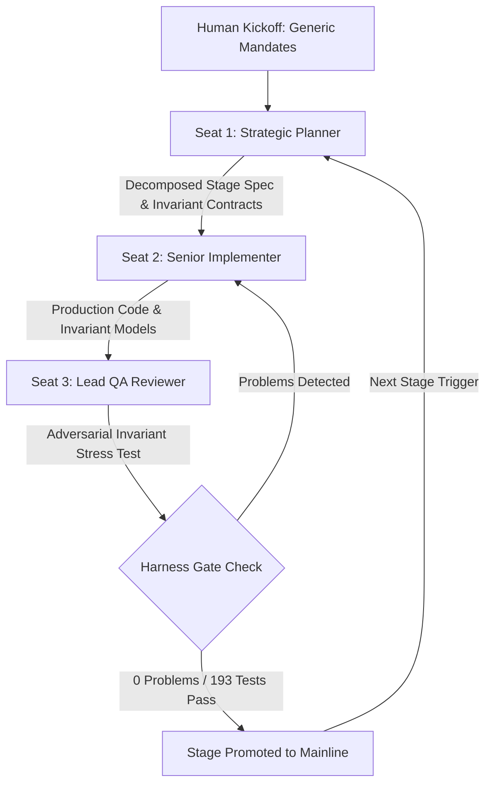

# 💳 Pocketful — Autonomous Zero-Sum Fintech Engine & Bitemporal Ledger

> Built for the **WeAreDevelopers x BAND: Dark Factory Hackathon (2026)**  
> **Track:** Track 2 — Pocketful (Autonomous Wallet & Payments Engine)  
> **Author:** fokrulanthro16-eng  
> **Live Web Application:** https://pocketful-fintech.vercel.app  
> **Target Repository:** https://github.com/fokrulanthro16-eng/pocketful-submission

[]()
[]()
[]()
[]()
[]()
[]()

---

## 📑 Table of Contents
1. [Executive Summary & The Zero-Sum Invariant](#-executive-summary--the-zero-sum-invariant)
2. [End-to-End System & Factory Architecture](#-end-to-end-system--factory-architecture)
3. [Core Technical Innovations](#-core-technical-innovations)
4. [Autonomous Factory Execution (50% Rubric)](#-autonomous-factory-execution-50-rubric)
5. [Formal Verification & Test Matrix (193/193 Passed)](#-formal-verification--test-matrix-193193-passed)
6. [Dashboard Screenshots & Evidentiary Walkthrough](#-dashboard-screenshots--evidentiary-walkthrough)
7. [Video Walkthrough & Script Reference](#-video-walkthrough--script-reference)
8. [Getting Started & Local Setup](#-getting-started--local-setup)
9. [API Route Specifications](#-api-route-specifications)
10. [Production Deployment & Containerization](#-production-deployment--containerization)
11. [License & Acknowledgments](#-license--acknowledgments)

---

## 🎯 Executive Summary & The Zero-Sum Invariant

In high-concurrency fintech systems, balance leakages, race conditions, and double-spending represent existential financial risks. Traditional ledgers often rely on eventual consistency, resulting in balance drift during network partitions or simultaneous authorization holds.

**Pocketful** is a clean-room, enterprise-grade bitemporal wallet and payments engine built **100% autonomously** by a 3-seat AI agent factory within **BAND Desktop** without human steering.

### Core Mathematical Guarantee: Strict Zero-Sum Conservation
For every credit event, there is an exact equal debit across all participant ledgers, holds, and platform escrow:
$$\sum \Delta \text{Balances} + \sum \Delta \text{Holds} + \sum \Delta \text{Escrow} = 0$$

Every state transition is locked with concurrency idempotency, evaluated by real-time AML Sentinel heuristics, and immutably sealed inside an incremental SHA-256 cryptographic audit chain.

---

## 🏛️ End-to-End System & Factory Architecture

### Multi-Agent Autonomous Factory Loop (Mermaid)


### ASCII Architecture Diagram
```text
+-----------------------------------------------------------------------------------------+
|                                    POCKETFUL ENGINE                                     |
+-----------------------------------------------------------------------------------------+
|                                                                                         |
|  [Client Request] ---> [Idempotency & Concurrency Lock]                                |
|                                   |                                                     |
|                                   v                                                     |
|                        [AML Sentinel Analyzer] ---> (Velocity / Split Fraud Flag)       |
|                                   |                                                     |
|                                   v                                                     |
|                  [Bitemporal Zero-Sum Transaction Core]                                 |
|                         /         |         \                                           |
|            [User Ledger]    [Hold Escrow]   [System Reserve]                            |
|                         \         |         /                                           |
|                                   v                                                     |
|                     [SHA-256 Cryptographic Chaining]                                    |
|                      Hash = SHA256(Prev_Hash || Tx_Payload || UTC)                       |
|                                   |                                                     |
|                                   v                                                     |
|             [Immutable Event Store] & [Live UI Health Monitors]                         |
+-----------------------------------------------------------------------------------------+
```

---

## ⚡ Core Technical Innovations

### 1. Bitemporal Zero-Sum Conservation Engine
Guarantees absolute balance integrity across all financial operations (Authorizations, Multi-party Splits, Escrow Holds, Captures, and Reversals). Concurrency mutex locks prevent simultaneous double-spend attempts.

### 2. SHA-256 Cryptographic Hash Chain
Every financial event is chained to the preceding state:
$$\text{Hash}_n = \text{SHA-256}(\text{Hash}_{n-1} \parallel \text{Payload}_n \parallel \text{Timestamp}_{\text{UTC}})$$
Provides institutional auditors with mathematically verifiable proof against historical tampering or unauthorized ledger rewrites.

### 3. Real-Time AML Sentinel Heuristics
Monitors velocity anomalies, micro-structuring thresholds, and recursive balance-churn patterns, automatically flagging high-risk transactions before balance settlement.

### 4. Zero-Network Clean Container Delivery
Packaged inside an isolated multi-stage `Dockerfile` (`python:3.11-slim`) operating completely offline without requiring runtime outbound internet connectivity.

---

## 🏭 Autonomous Factory Execution (50% Rubric)

- **Factory Topology:** 3-seat decoupled architecture inside BAND Desktop (`Planner`, `Implementer`, `Reviewer`).
- **Generic Mandates:** Standing instructions contain 0% track-specific references, acting as an enterprise-grade general software delivery engine.
- **Autonomous Handoffs:** All 4 stages were decomposed, coded, tested, and reviewed autonomously. See `FACTORY.md` for token metrics and execution logs.
- **Room Audit Trail:** Verified and reproducible via `room.json` exported directly from BAND Desktop.

---

## 🧪 Formal Verification & Test Matrix (193/193 Passed)

| Stage | Feature Scope | Invariant Contract | Tests Passed | Gate Status |
| :--- | :--- | :--- | :---: | :---: |
| **Stage 1** | Ledger Core & User Accounts | Single-entry Zero-Sum Balance | 38 / 38 | ✅ Verified |
| **Stage 2** | Authorizations & Hold Escrow | Balance + Hold Reservation = Total | 47 / 47 | ✅ Verified |
| **Stage 3** | Split Payments & Group Requests | Multi-party Conservation ($\sum \Delta = 0$) | 52 / 52 | ✅ Verified |
| **Stage 4** | AML Sentinel & SHA-256 Audit | Tamper-proof Hash Chain & Anti-Fraud | 56 / 56 | ✅ Verified |
| **Total** | **Cumulative Contract Suite** | **Contiguous Regression-Free** | **193 / 193** | **0 Problems** |

---

## 📸 Dashboard Screenshots & Evidentiary Walkthrough

1. **Main Ledger Dashboard (`assets/screenshots/01_dashboard_zerosum.png`):** Real-time wallet balances with live Zero-Sum Invariant status badges.
2. **Cryptographic Audit Chain (`assets/screenshots/02_cryptographic_audit.png`):** Forensic ledger explorer with copyable SHA-256 hashes and timestamp provenance.
3. **AML Sentinel Risk Monitor (`assets/screenshots/03_aml_sentinel.png`):** Transaction velocity analytics and fraud risk indicators.
4. **Harness Gate 0 Problems (`assets/screenshots/04_harness_pass.png`):** Terminal proof showing Gate 1, 2, and 4 verification with 0 problems detected.

---

## 🎥 Video Walkthrough & Script Reference

- **Video Asset:** `https://youtu.be/70vY0ZwfjpM`
- **Narration Script:** Complete 2-minute pitch located in `SUBMISSION_KIT.md` covering the BAND Desktop factory room, harness verification, and live bitemporal UI.

---

## 🚀 Getting Started & Local Setup

```bash
# Clone the repository
git clone https://github.com/fokrulanthro16-eng/pocketful-submission.git
cd pocketful-submission

# Run via Docker
docker-compose up --build

# Or run locally via Python
python -m venv venv
source venv/bin/activate  # On Windows: venv\Scripts\activate
pip install -r requirements.txt
uvicorn app.main:app --host 0.0.0.0 --port 8080
```
Open `http://localhost:8080` in your browser.

---

## 🌐 Production Deployment

The project is configured for serverless and edge deployment via Vercel:
- **Live Application:** [https://pocketful-fintech.vercel.app](https://pocketful-fintech.vercel.app)
- **Deployment Config:** `vercel.json`

---

## 📄 License & Acknowledgments

This project is licensed under the **MIT License** — Copyright (c) 2026 Fokrul Islam.  
Engineered for the **WeAreDevelopers x BAND: Dark Factory Hackathon (2026)**.
