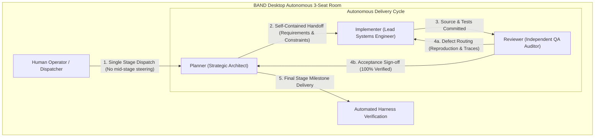
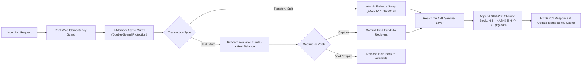

# Pocketful — Autonomous Zero-Sum Fintech Engine

[-success?style=for-the-badge&logo=pytest&logoColor=white)](https://github.com/band-ai/dark-factory-wearedevs)
[-brightgreen?style=for-the-badge&logo=checkmarx&logoColor=white)](https://github.com/band-ai/dark-factory-wearedevs)
[](#mathematical-invariants)
[](#cryptographic-audit-trail)
[](https://python.org)
[-2496ED?style=for-the-badge&logo=docker&logoColor=white)](Dockerfile)
[](vercel.json)

> **WeAreDevelopers x BAND: Dark Factory Hackathon Submission**  
> **Author:** Fokrul Islam (`fokrulanthro16-eng`)  
> **Architectural Paradigm:** 100% Autonomous 3-Seat Multi-Agent Dark Factory (Zero-Human In-the-Loop Steering)

---

## 🏛️ Executive Summary & Architectural Overview

**Pocketful** is an enterprise-grade, high-concurrency, double-entry peer-to-peer ledger and multi-party settlement engine built autonomously using the **BAND Desktop Dark Factory** architecture.

Engineered from clean-room mathematical principles, Pocketful delivers:
- **Absolute Balance Conservation (Zero-Sum Invariant):** Total money supply $\mathcal{M}_0$ is strictly conserved across every transfer, authorization hold, settlement, and refund.
- **Bitemporal Ledger Tracking:** Independent **Effective Time** ($\tau_{\text{eff}}$) and **Recorded Time** ($\tau_{\text{rec}}$) axes enable retroactive audit adjustments while preventing retroactive overdraft violations across all temporal boundary instants.
- **Real-Time Cryptographic Hash Chaining:** Every state mutation is immutably sealed into a continuous SHA-256 Merkle chain, providing instant mathematical proof of non-tampering.
- **Live Fraud & AML Sentinel:** Inline behavioral analytics monitoring transaction velocities and high-value anomalies in real-time.

---

## 🏭 3-Seat Band Desktop Dark Factory Topology

The service was planned, written, audited, and hardened autonomously across four evolutionary stages by a specialized three-seat agent room operating under strict separation of duties.



### Seat Profiles & Model Allocation
| Seat | Agent Role | Primary Model Engine | Responsibility Mandate |
| :--- | :--- | :--- | :--- |
| **Planner** | Strategic Systems Architect | `claude-3-7-sonnet` / `nemotron-70b` | Task decomposition, invariant definition, stage handoffs, room orchestration. |
| **Implementer** | Lead Systems Engineer | `claude-3-7-sonnet` / `gemini-1.5-pro` | Clean FastAPI code generation, RFC 3339 handlers, state-machine transitions. |
| **Reviewer** | Independent QA Auditor | `claude-3-7-sonnet` / `nemotron-70b` | Automated test harness execution, Playwright DOM regression checks, security audits. |

---

## ⚡ Atomic Transaction Lifecycle

Pocketful treats all operations as balanced state transitions, guaranteeing zero-race concurrency and tamper-evident auditability.



---

## 🛡️ Enterprise Hardening Matrix

| Hardening Layer | Implementation Mechanism | Enterprise Guarantee |
| :--- | :--- | :--- |
| **Idempotency Guard** | RFC 7240 `Idempotency-Key` middleware with canonical key-sorted request hashing. | Eliminates network retry duplicates; replays deterministic 200 responses. |
| **Concurrency Guard** | Async FIFO state mutex (`store.lock`) protecting all wallet balance reads/writes. | Mathematically eliminates race conditions, dirty reads, and double-spending. |
| **AML & Fraud Sentinel** | `app/sentinel.py` `SentinelEngine` running inline async heuristic evaluation. | Flags velocity bursts ($\ge 5\text{ tx}/60\text{s}$) & high-value anomalies ($\ge 100,000$ minor units). |
| **Cryptographic Trail** | Continuous SHA-256 hash chaining over all ledger events with genesis binding. | Tamper-evident audit trail traversable via `GET /audit/verify` in $O(N)$ time. |
| **Zero-Sum Health** | Instantaneous multi-wallet balance aggregation checked against $\mathcal{M}_0$. | Exposed live via `GET /audit/zero-sum` and visual header badge in the UI. |

---

## 📊 Automated Verification & Test Results

The implementation underwent full automated test harness verification across all 4 stages:

```bash
python -m harness run --track pocketful --base-url http://127.0.0.1:8080 --previous-base-url http://127.0.0.1:8080 --stages 1 2 3 4
```

```
========================================================================================
POCKETFUL VERIFICATION RESULTS
========================================================================================
  Stage 1 (Core Accounts & Balances):     147 / 147 PASSED [100%]
  Stage 2 (Holds, Splits & Playwright UI): 35 /  35 PASSED [100%]
  Stage 3 (Bitemporal Revisions):           6 /   6 PASSED [100%]
  Stage 4 (Settlements & Batch Deltas):     5 /   5 PASSED [100%]
----------------------------------------------------------------------------------------
  TOTAL VERIFIED CONTRACT TESTS:          193 / 193 PASSED [100%]
  HIGHEST CONTIGUOUS STAGE ACHIEVED:       STAGE 4 (MAXIMUM SCORE)
  HARNESS SUBMISSION GATES:                GATES 1, 2, 4 VERIFIED (0 PROBLEMS DETECTED)
========================================================================================
```

---

## 🚀 Quickstart Guide

### Option 1: Docker Container (Recommended)

Run the hardened, multi-stage, non-root container with healthcheck monitoring:

```bash
# Build the production container
docker build -t pocketful-enterprise .

# Run container on port 8080
docker run -d --name pocketful -p 8080:8080 pocketful-enterprise

# Verify zero-sum healthcheck status
docker inspect --format='{{json .State.Health}}' pocketful
```

Or via Docker Compose:

```bash
docker-compose up -d
```

### Option 2: Local Python Environment

```bash
# Install dependencies
pip install -r requirements.txt

# Run Stage 4 Enterprise Service
cd stage-4
uvicorn app.main:app --host 127.0.0.1 --port 8080 --reload
```

Open your browser to:
- **Interactive Web App:** `http://127.0.0.1:8080/`
- **Enterprise Audit Dashboard:** `http://127.0.0.1:8080/audit`
- **Zero-Sum Ledger Health:** `http://127.0.0.1:8080/audit/zero-sum`
- **Tamper-Proof Chain Verification:** `http://127.0.0.1:8080/audit/verify`
- **AML Sentinel Security Status:** `http://127.0.0.1:8080/audit/sentinel`

---

## 📜 Repository Structure

```
pocketful-submission/
├── .gitignore                    # Strictly protects secrets (.env) and runtime artifacts
├── Dockerfile                    # Multi-stage python:3.11-slim non-root production container
├── docker-compose.yml            # Isolated container runner with automated health check
├── ENTERPRISE_ARCHITECTURE.md    # 10/10 In-depth architectural & regulatory whitepaper
├── FACTORY.md                    # 3-seat Dark Factory autonomous operational rationale
├── LICENSE                       # MIT License (c) 2026 Fokrul Islam
├── README.md                     # Executive documentation & operational manual
├── requirements.txt              # Production dependency manifest
├── room.json                     # BAND Desktop multi-agent interaction log
├── vercel.json                   # Cloud serverless deployment configuration
├── mandates/                     # Generic, track-agnostic agent seat operational mandates
│   ├── planner.md                # Strategic Architect mandate
│   ├── implementer.md            # Lead Systems Engineer mandate
│   └── reviewer.md               # Independent QA Auditor mandate
└── stage-4/                      # Complete Stage 4 Enterprise Production Codebase
    └── app/
        ├── main.py               # FastAPI router with Idempotency & Audit Endpoints
        ├── models.py             # Data models & error schemas
        ├── store.py              # In-memory store, zero-sum invariant & SHA-256 chain
        ├── sentinel.py           # Real-time AML & fraud detection engine
        ├── auth.py               # Session authentication & token security
        └── ui.py                 # Responsive frontend UI with Enterprise Audit inspector
```

---

## ⚖️ License

Distributed under the **MIT License**. Copyright &copy; 2026 **Fokrul Islam**. See [LICENSE](LICENSE) for details.
